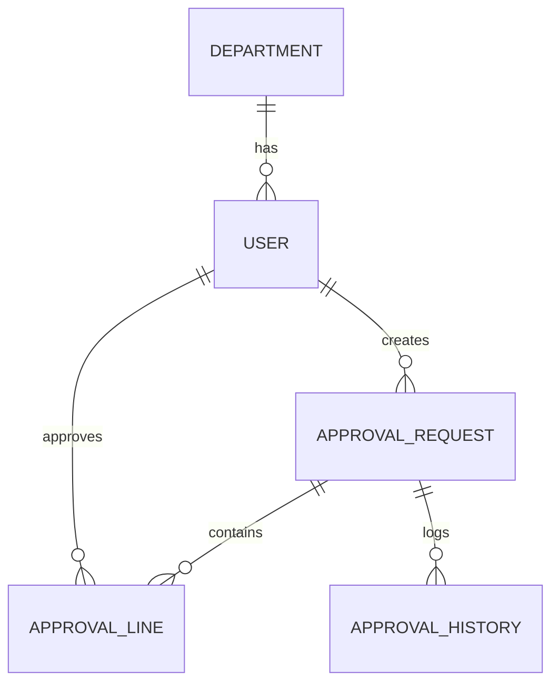

# ERD - 전자결재 시스템

---

## 1. User (사용자)

| Column | Type | Description |
|--------|------|-------------|
| id | Long | PK |
| username | String | 로그인 ID |
| password | String | 비밀번호 |
| name | String | 이름 |
| department_id | Long | 부서 FK |
| created_at | DateTime | 생성일 |
| updated_at | DateTime | 수정일 |
| delete_yn | Boolean | 삭제 여부 (soft delete) |

---

## 2. Department (부서)

| Column | Type | Description |
|--------|------|-------------|
| id | Long | PK |
| name | String | 부서명 |
| parent_id | Long | 상위 부서 ID |
| created_at | DateTime | 생성일 |
| updated_at | DateTime | 수정일 |
| delete_yn | Boolean | 삭제 여부 |

---

## 3. ApprovalRequest (결재 요청)

| Column | Type | Description |
|--------|------|-------------|
| id | Long | PK |
| title | String | 제목 |
| content | Text | 내용 |
| status | Enum | PENDING / IN_PROGRESS / APPROVED / REJECTED |
| created_by | Long | 작성자 (USER FK) |
| created_at | DateTime | 생성일 |
| updated_at | DateTime | 수정일 |
| delete_yn | Boolean | 삭제 여부 |

---

## 4. ApprovalLine (결재 라인)

| Column | Type | Description |
|--------|------|-------------|
| id | Long | PK |
| request_id | Long | 결재 요청 FK |
| approver_id | Long | 결재자 FK |
| order_no | Int | 결재 순서 |
| status | Enum | PENDING / IN_PROGRESS / APPROVED / REJECTED |
| comment | String | 결재 의견 |
| decision_at | DateTime | 결재 처리 시간 |
| created_at | DateTime | 생성일 |
| updated_at | DateTime | 수정일 |
| delete_yn | Boolean | 삭제 여부 |

---

## 5. ApprovalHistory (이력)

| Column | Type | Description |
|--------|------|-------------|
| id | Long | PK |
| request_id | Long | 결재 요청 FK |
| action | String | APPROVE / REJECT |
| comment | String | 코멘트 |
| created_at | DateTime | 생성일 |
| delete_yn | Boolean | 삭제 여부 |

---

# Mermaid ERD Diagram

